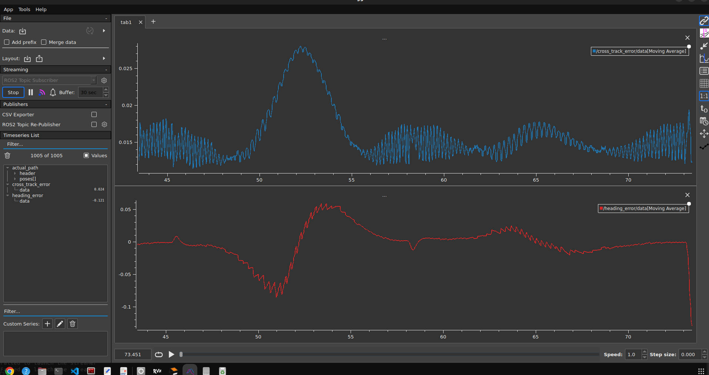
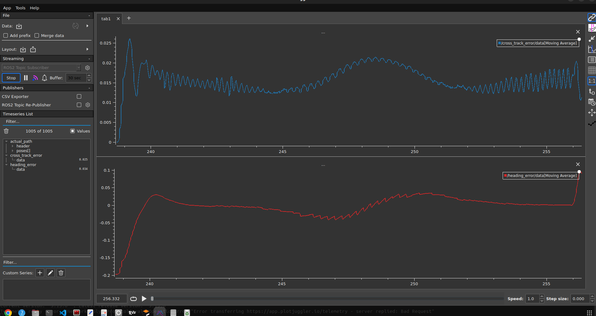
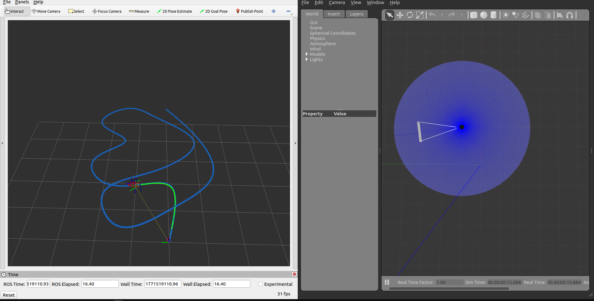

## Overview

This project implements:

- Path smoothing using cubic spline interpolation
- Time-parameterized trajectory generation
- Pure Pursuit trajectory tracking
- Simulation on TurtleBot3 (ROS2 + Gazebo)
- Performance evaluation using error metrics

The goal is to convert discrete 2D waypoints into a smooth trajectory and accurately track it using a differential drive robot.

## Instructions

Basic setup:

```

# Source ROS 2
source /opt/ros/humble/setup.bash
```

**Repository**

Navigate to your ros2 workspace and clone this repository inside the `src` folder:

```
mkdir -p ~/origin_ws/src
cd ~/origin_ws/src

# Clone the  repo
git clone https://github.com/hanmol0312/trajectory_control.git
# Build the workspace
cd ~/origin_ws
colcon build --symlink-install

# Source the workspace
source install/setup.bash
```

**Changing paramater file and updating parameters:**

```jsx
cd ~/origin_ws/src/trajectory_control/config
nano controller_params.yaml

trajectory_controller:
  ros__parameters:

    # lookahead: 0.05
    # velocity: 0.2
    goal_position_tolerance: 0.1
    goal_heading_tolerance: 0.1
    lookahead: 0.2
    max_velocity: 0.4
    curvature_gain: 2.0
    k_theta: 0.8
    omega_max: 1.8

    # waypoints: [                                        #straight line
    #   0.0, 0.0,
    #   5.0, 0.0
    # ]

    # waypoints: [                                          # gentle_curve
    #   0.0, 0.0,
    #   2.0, 0.0,
    #   2.0, 2.0
    # ]
    
    # waypoints: [                                            # sharp turn
    #   0.0, 0.0,
    #   2.0, 0.0,
    #   2.0, 2.0
    # ]

    waypoints: [

      # --- Straight ---
      0.0, 0.0,
      2.0, 0.0,

      # --- 90 degree turn ---
      2.0, 2.0,

      # --- Zig-zag ---
      3.0, 2.5,
      4.0, 1.5,
      5.0, 2.5,
      6.0, 1.5,

      # --- S-curve ---
      5.5, 0.5,
      4.0, -1.0,
      2.5, 0.5,

      # --- Tight U-turn ---
      1.5, 2.0,
      0.5, 1.5,
      1.0, 0.0,

      # --- Final smooth return ---
      2.5, -1.5,
      4.5, -1.0,
      6.0, 0.0

    ]

```

**Running the Launch File:**

Run these commands in the terminal where you buit the code:

```
# Ensure you are in turtlebot3_ws
cd ~/origin_ws
source install/setup.bash
ros2 launch trajectory_control trajectory.launch.py
```

This will launch the rviz, gazebo showing the trajectory smoothened and the trajectory taken by the robot on the way.


## Error Stats for various trajectories(Cross_track error and heading error):

## 📈 S-Curve



## 📈 Sharp Curve



## 📈 Trajectory Generation Profile


